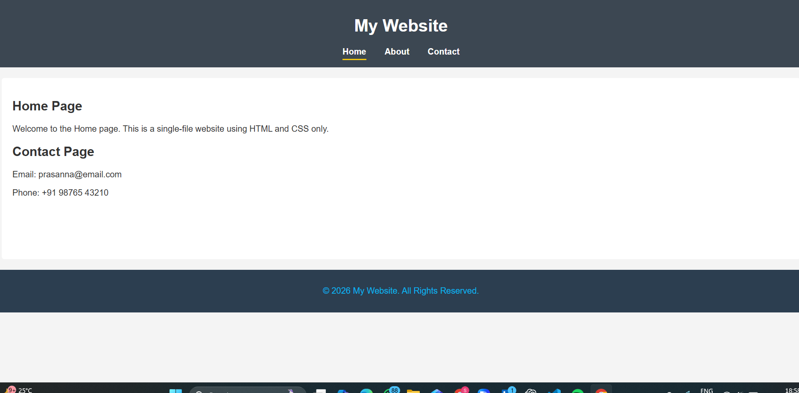

# Simple-Multi-Page-Website

1.Project Description

This project demonstrates the creation of a multi-page website within a single HTML file using HTML and CSS only. The website contains three main sections: Home, About, and Contact, all accessible through a common navigation bar. Instead of using multiple HTML files, this project uses CSS techniques to switch between pages, making it simple, lightweight, and easy to maintain.

The main goal of this project is to help beginners understand website structure, navigation systems, layout consistency, and CSS styling, while keeping everything in one file for easy submission and testing.

2.Objectives

*To design a clean and structured website using HTML

*To apply CSS for layout, styling, and visual consistency

*To create a navigation system that simulates multiple pages

*To highlight the active navigation link

*To maintain a consistent header, content area, and footer

*To understand the use of CSS selectors such as :target

3.Technologies Used

*HTML5 – For structuring the webpage content

*CSS3 – For styling, layout, navigation, and page switching

*No JavaScript or external libraries are used in this project.

4.Project Structure

The entire website is implemented in one single HTML file (index.html).
All CSS styles are written inside the <style> tag in the <head> section.

Main components include:

*Header – Contains the website title and navigation menu

*Navigation Bar – Links to Home, About, and Contact sections

*Main Content Area – Displays one section at a time

*Footer – Displays copyright information

5.Navigation System

The navigation system uses anchor links (#home, #about, #contact).
Each section is assigned a unique id.

CSS uses the :target pseudo-class to:

*Show the selected section

*Hide the other sections

*This approach allows the website to behave like a multi-page site while remaining a single file.

6.Styling and Layout

*A consistent color scheme is used across all sections

*The navigation menu highlights the active page

*Box model concepts such as margin, padding, and border-radius are applied

*The layout remains the same for all sections to ensure consistency

7.Features

*Single HTML file

*Clean and simple design

*Functional navigation

*Active link highlighting

*Consistent layout and footer

*Beginner-friendly and easy to understand

8.How to Run the Project

*Save the file as index.html

*Open the file in any modern web browser

*Click on the navigation links to switch between pages

output:
screenshot
screenshot
